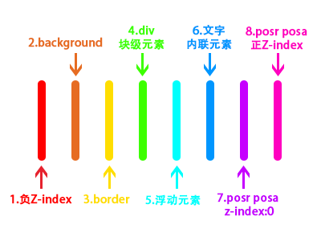

## 堆叠上下文的理解

1. ###### 对于 HTML中的某个元素,如果符合下面的条件,说它是堆叠上下文,记住***斜体***的情况即可

   - ***根元素 (HTML)***
   - ***z-index 值不为 "auto"的 绝对/相对定位***
   - 一个 z-index 值不为 "auto"的 flex 项目 (flex item)，即：父元素 display: flex|inline-flex
   - opacity 属性值小于 1 的元素（参考 the specification for opacity）
   - transform 属性值不为 "none"的元素
   - mix-blend-mode 属性值不为 "normal"的元素
   - filter值不为“none”的元素
   - perspective值不为“none”的元素
   - isolation 属性被设置为 "isolate"的元素
   - position: fixed
   - 在 will-change 中指定了任意 CSS 属性，即便你没有直接指定这些属性的值（参考 这篇文章）
   - -webkit-overflow-scrolling 属性被设置 "touch"的元素

2. 如果整个HTML文件都没有触发堆叠上下文的条件,那么根元素(HTML)就是一个堆叠上下文

3. 一个堆叠上下文 可以是 一个`div`

   ## 堆叠顺序八层

   

   ## 思考题

   1. 以下元素中，哪些是堆叠上下文？ADEHI

      A. html 元素

      B. body 元素

      C. div style="position: relative; z-index: auto;"

      D. div style="position: fixed; z-index: auto;"

      E. div style="position: relative; z-index: 0;"

      F. div style="background-color: rgba(255,0,0,0.5);"

      G. div style="opacity: 1;"

      H. div style="opacity: 0.99;"I. div style="position: absolute; z-index: 0;"

      ​

- 对于 HTML中的某个元素,如果符合下面的条件,说它是堆叠上下文,记住粗体的情况即可

  ​

  ​

  z-index 值不为 "auto"的 绝对/相对定位，

  一个 z-index 值不为 "auto"的 flex 项目 (flex item)，即：父元素 display: flex|inline-flex，

  opacity 属性值小于 1 的元素（参考 the specification for opacity），

  transform 属性值不为 "none"的元素，

  mix-blend-mode 属性值不为 "normal"的元素，

  filter值不为“none”的元素，

  perspective值不为“none”的元素，

  isolation 属性被设置为 "isolate"的元素，

  position: fixed

  在 will-change 中指定了任意 CSS 属性，即便你没有直接指定这些属性的值（参考 这篇文章）

  -webkit-overflow-scrolling 属性被设置 "touch"的元素

  ​

- 如果整个HTML文件都没有触发堆叠上下文的条件,那么根元素(HTML)就是一个堆叠上下文

- 一个堆叠上下文 可以是 一个`div`