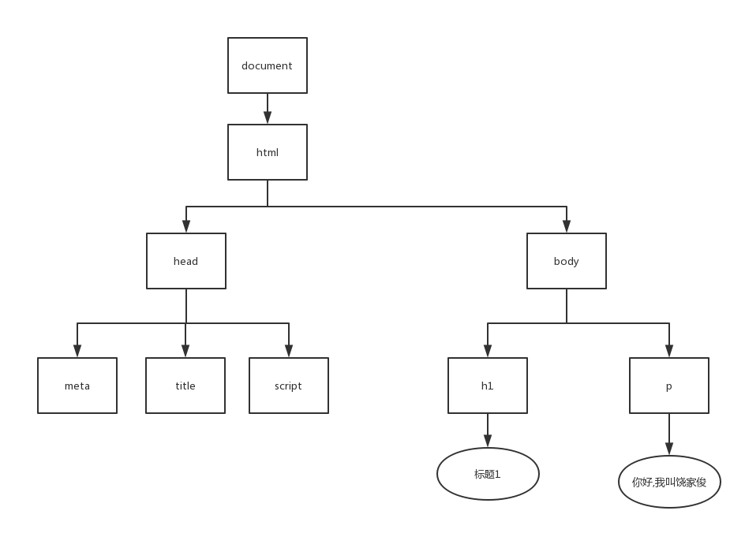
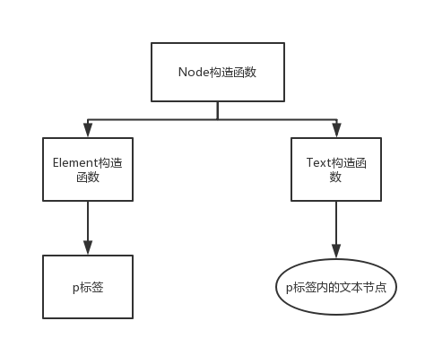
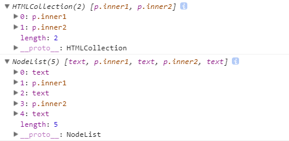

# 重点

1.DOM:Document Object Model文档对象模型

2.树形结构

- 下图中每个节点都是Node类型
- document节点是**Document**构造函数的一个实例对象，通过**document**获取document节点
- html节点又叫**根节点**，是**Element**构造函数的一个实例对象，通过**document.documentElement**获取html节点




- node包含Document（html）、Element（元素）和 Text（文本）等共7种节点
  - Node.ELEMENT_NODE 	       1	           元素节点
  - Node.TEXT_NODE                        3                 文本节点
  - Node.DOCUMENT_NODE           9                 document节点




# API相关

### Node 的接口

- **Node.nodeName**  **Node.nodeType**  **Node.textContent**(与**innerText**区别)

  - Node.nodeName:**大写的HTML元素名**  (svg类型为小写)
  - Node.noneType:返回Node类型，常见的1/3/9
  - Node.textContent:**Node**类型，返回文本内容（如包含<style>、<script>也一起返回）
    - Node.innerText:只返回纯文本内容
    - Element.innerHTML:**element**类型，TextNode.innerHTML返回的是undefined
      - 设置（document.body.innerHTML = ""; ）
      - 获取描述元素后代的HTML语法（返回<div id="1">1节点</div>）

- 属性(childNodes,firstChild,innerText,lastChild,nextSibling,nodeName,nodeType,nodeValue,outerText,ownerDocument,parentElement,parentNode,previousSibling,textContent)

  兄弟关系：Node.previousSibling	Node.nextSibling

  儿子关系：Node.childNodes	Node.firstNode	Node.lastChild

  父关系:Node.parentNode

  - child / children / parent
  - node
  - first / last
  - next / previous
  - sibling 
  - type
  - value / text / content
  - inner / outer
  - element

- 方法appendChild(),cloneNode(),contains(),hasChildNodes(),insertBefore(),isEqualNode(),isSameNode(),removeChild(),replaceChild(),normalize() 

### Document 接口

- 属性
  1. 用于指向其他节点(快捷获取某些特殊节点)的属性
     - document.documentElement指向 DOM 的 html节点
     - document.activeElement指向获得焦点的那个节点
  2. 返回文档特定元素的伪数组集合的属性
     - document.links
     - document.forms
     - document.images
     - document.embeds
     - ......
  3. 返回文档信息的属性
     - document.location
     - document.readyState返回的是当前文档的状态
     - ......
- 方法
  1. 获取节点方法
     - 常用接口document.querySelector()和document.querySelectorAll()（querySelectorAll返回**伪数组**，结果是**静态**的）
  2. 生成节点方法
     - documen.createElement("div")
     - document.createTextNode("hello world")

# 思考1：elem.children和elem.childNodes的区别？

```
<div id="box">
    <p class="inner1">xiami</p>
    <p class="inner2">haozi</p>
</div>
<script>
    var box = document.getElementById("box");
    console.log(box.children);//HTMLCollection
    console.log(box.childNodes);//NodeList
</script>
```



- 在HTMLCollection下
  - 
    p.para的textContent是"xiami"
  - 
    p.attr的textContent是"haozi"


- 在NodeList下
  - 
    text的textContent是"↵ "
  - 
    p.para的textContent是"xiami"
  - 
    text的textContent是"↵ "
  - 
    p.attr的textContent是"haozi"
  - 
    text的textContent是"↵ "


- **HTMLCollection**与**NodeList**总结

  - HTMLCollection和NodeList的**共同点**显而易见：
    1. 都是类数组对象，都有length属性
    2. 都有共同的方法：item，可以通过item(index)来访问返回结果中的元素
    3. 都是实时变动的（live），document上的更改会反映到相关对象上（例外：**document.querySelectorAll**返回的NodeList是**静态**的）


- HTMLCollection和NodeList的区别是：

    1. NodeList可以包含任何节点类型，HTMLCollection只包含元素节点（elementNode），elementNode就是HTML中的标签
    2. HTMLCollection比NodeList多一项方法：namedItem，可以通过传递id或name属性来获取节点信息

# 思考2： Element与Node

Node是一个基础类型，document, element, text, comment, DocumentFragment等都继承于Node. 即element, text, comment都是Node的子类，可以将它们视为：elementNode, textNode以及commentNode.平时在DOM中最常用的Element对象，其本质就是elementNode.