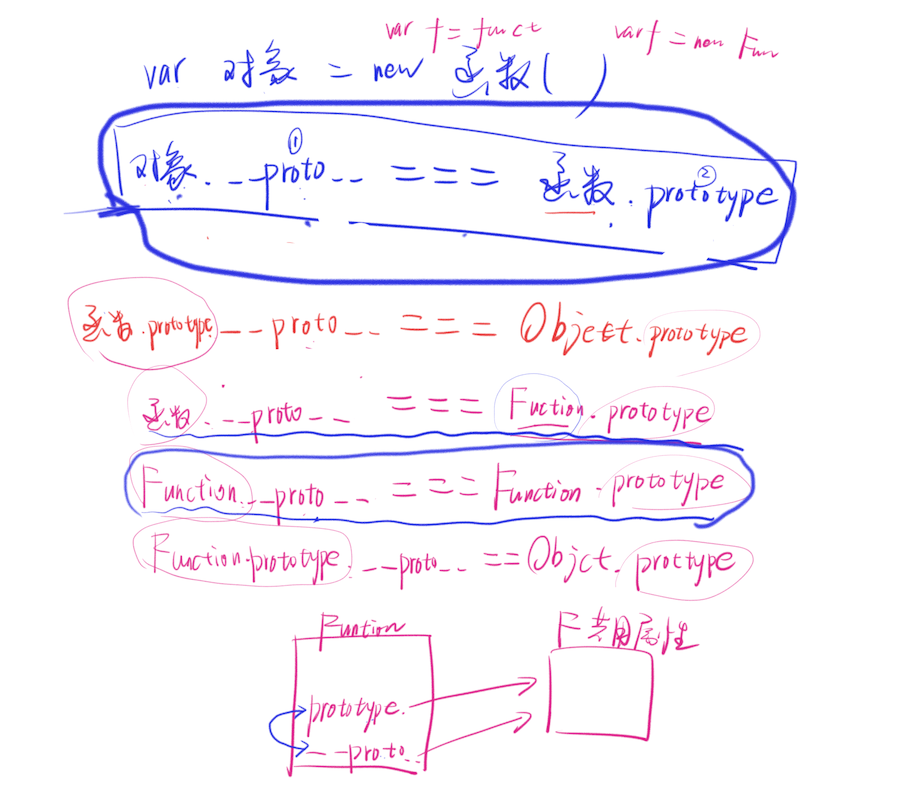
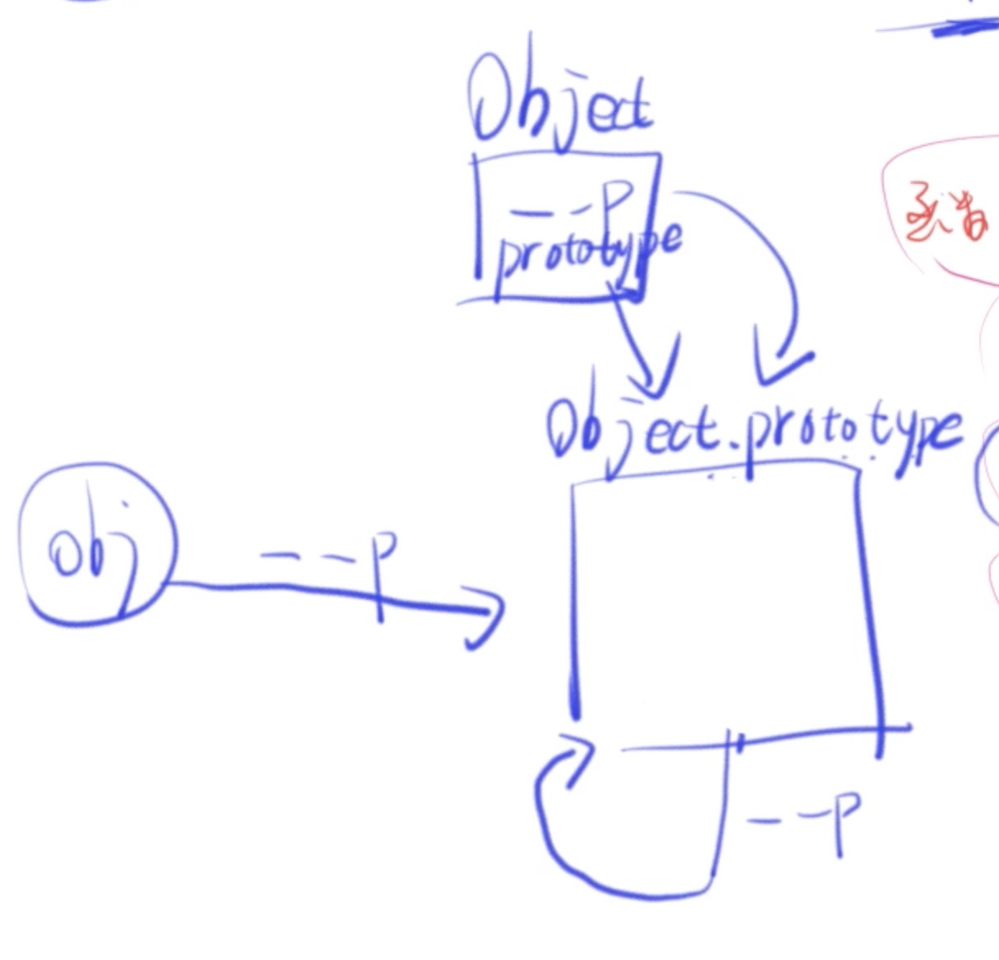

## 全局对象 window

ECMAScript 规定全局对象叫做 global，但是浏览器把 window 作为全局对象（浏览器先存在的）

window 就是一个哈希表，有很多属性。

window 的属性就是全局变量。

这些全局变量分为两种：

1. 一种是 ECMAScript 规定的
   - global.parseInt
   - global.parseFloat
   - global.Number
   - global.String
   - global.Boolean
   - global.Object
2. 一种是浏览器自己加的属性
   - window.alert
   - window.prompt
   - window.comfirm
   - window.console.log
   - window.console.dir
   - window.document
   - window.document.createElement
   - window.document.getElementById

所有 API 都可以在 MDN 里找到详细的资料。

今天我们学习第一种全局变量。

## 全局函数

1. Number
   var n = new Number(1) 创建一个 Number 对象
   1 与 new Number(1) 的区别是什么？看内存图
2. String
   var s = new String('hello') 创建一个 String 对象
   'hello' 与 new String('hello') 的区别是什么？看内存图
3. Boolean
   var b = new Boolean(true) 创建一个 Boolean 对象
   true 与 new Boolean(true) 的区别是什么？看内存图
4. Object
   var o1 = {}
   var o2 = new Object()
   o1 和 o2 没区别

## 公用的属性藏在哪

所有对象都有 toString 和 valueOf 属性，那么我们是否有必要给每个对象一个 toString 和 valueOf 呢？

明显不需要。

JS 的做法是把 toString 和 valueOf 放在一个对象里（暂且叫做公用属性组成的对象）

然后让每一个对象的 `__proto__` 存储这个「公用属性组成的对象」的地址。

## 重要公式

```
var 对象 = new 函数()
对象.__proto__ === 函数.prototype

1.宗旨    对象.__proto__===构造函数.prototype
2.        函数.__proto__===Function.prototype   函数(包括普通函数以及Function)的构造函数是Function
3.        函数.prototype.__proto__===Objcect.prototype(函数(包括普通函数以及Function)) (函数.prototype)的构造函数是Object
4.        Object.__ptoto__ === Function.prototype   Object 的构造函数是Function 
5.总结    严格遵循[对象.__proto__===构造函数.prototype],除了(prototype)的构造函数是Object,其余(函数、Object)的构造函数是Function,遇到fn.__proto__.__proto__,将fn.__proto__替换为Function.prototype,结果为Object.prototype
```

```

    if(f.__proto__===F.prototype){console.log(2)}//1.对象.__proto__===构造函数.prototype,注意f为new出来的对象

    if(f.__proto__!==Function.prototype){console.log(2.1)}
    if(F.__proto__===Function.prototype){console.log(3)}//2.函数.__proto__===Function.prototype
    if(Function.__proto__===Function.prototype){console.log(5)}//2.Function.__proto__===Function.prototype

    if(F.prototype.__proto__===Object.prototype){console.log(4)}//3.函数.prototype.__proto__===Object.prototype
    if(Function.prototype.__proto__===Object.prototype){console.log(6)}//3.Function.prototype.__proto__===Object.prototype

    if(Object.__proto__===Function.prototype){console.log(7)}
    if(Object.prototype.__proto__===Function.prototype){console.log(8)}//不成立，并且Object.prototype.__proto__为null
    
    
    var object = {}
    object.__proto__ === Object.prototype  // 为 true

    var fn = function () { }
    fn.__proto__ === Function.prototype  // 为 true
    fn.__proto__.__proto__ === Object.prototype // 为 true

    var array = []
    array.__proto__ === Array.prototype // 为 true
    array.__proto__.__proto__ === Object.prototype // 为 true

    Function.__proto__ === Function.prototype // 为 true
    Array.__proto__ === Function.prototype// 为 true
    Object.__proto__ === Function.prototype // 为 true

    true.__proto__ === Boolean.prototype // 为 true

    Function.prototype.__proto__ === Object.prototype // 为 true

```

`Object.__ptoto__ === Function.prototype，因为 Function 是 Object 的构造函数。`

